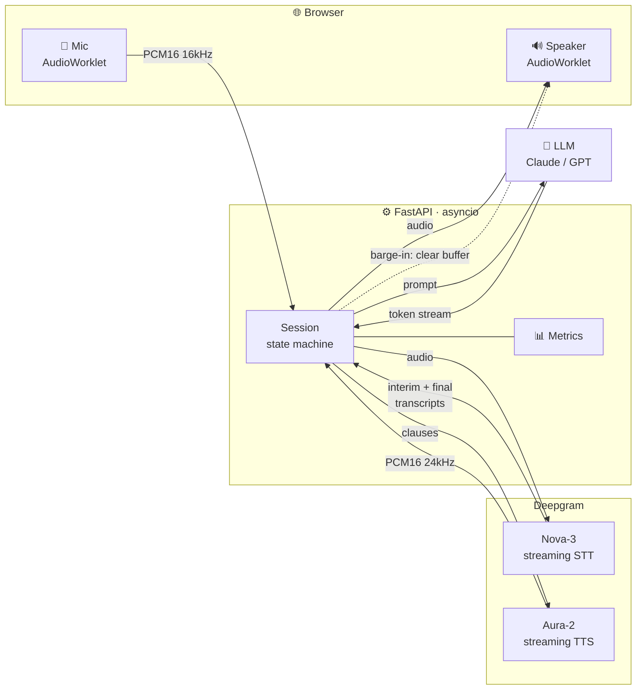
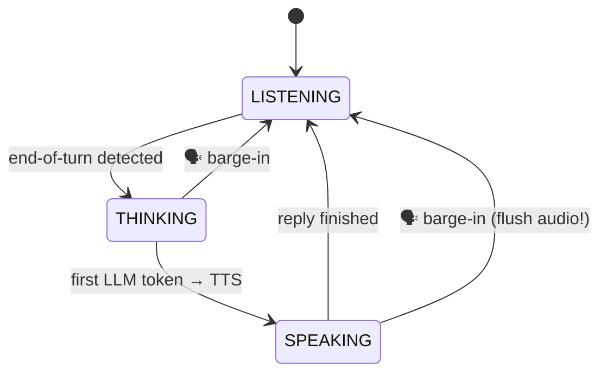

<div align="center">



# 🎙️ voice-agent

### A real-time, full-duplex voice assistant you can **interrupt mid-sentence.**

**Mic → streaming STT → LLM → streaming TTS**, all overlapped, all on [Deepgram](https://deepgram.com).
The whole point is one number: **how fast does it talk back?**

<br/>


<br/>


</div>

---

> [!NOTE]
> **📹 Record your own money-shot.** The animated banner above is a schematic of the
> real experience. Once you've run it locally, capture a ~15s screen recording of
> yourself talking to it (and cutting it off!), save it as `assets/demo.gif`, and
> swap the line below in. A recruiter watching *you* interrupt the bot and it
> stopping instantly is worth a thousand words.
>
> ```markdown
> 
> ```

<br/>

## 🧠 Why this is hard (and why that's the point)

Anyone can wire an STT box to an LLM box to a TTS box. That gives you a **walkie-talkie**:
you talk, you wait, it talks. It feels dead. A *real* voice agent has to solve the
problems that only show up when you care about latency and turn-taking:

<table>
<tr>
<td width="50%" valign="top">

#### 🚦 End-of-turn detection
Knowing *when the human is done talking* — not too eager (you cut them off), not too
slow (awkward pause). Uses Deepgram's `endpointing` + `UtteranceEnd` signals.

</td>
<td width="50%" valign="top">

#### ⏱️ Latency budgeting
Every millisecond is on a stopwatch. We overlap STT-finalize, LLM-first-token, and
TTS-first-audio so the reply *starts* before the model has finished thinking.

</td>
</tr>
<tr>
<td width="50%" valign="top">

#### 📝 Streaming partial transcripts
Interim results paint on screen as you speak — and double as the **trigger for barge-in**.

</td>
<td width="50%" valign="top">

#### ✋ Barge-in / interruption
Start talking while it's speaking and it **shuts up instantly**, flushes its audio
buffer, and starts listening again. This is the feature everyone forgets.

</td>
</tr>
</table>

<br/>

## 📊 The headline number

**Mouth-to-response** = time from *you stop talking* → *first byte of the reply's audio leaves the server.*

| Stage | What we measure | Typical |
|---|---|---:|
| 🎤 → 📝 | STT finalize (end-of-speech → final transcript) | ~150–250 ms |
| 📝 → 🧠 | LLM first token | ~200–350 ms |
| 🧠 → 🔊 | **TTS first audio (the headline)** | **~500–780 ms** |
| | **p95 mouth→response** | **< 800 ms** 🎯 |

> Numbers depend on your network, region, and LLM choice (a fast model like
> `claude-haiku` or `gpt-4o-mini` is the single biggest lever). The app **measures
> and displays these live** in the bottom bar, and `scripts/bench.py` reproduces them.

```
$ python scripts/bench.py samples/hello.wav --repeat 10

  run  1:  mouth→response   712.4 ms   (stt 190, llm 268)
  run  2:  mouth→response   688.1 ms   (stt 176, llm 251)
  ...
  ── mouth→response ─────────────────
  p50   704.9 ms
  p95   779.2 ms
  min   661.0 ms   max   791.3 ms
```

<br/>

## 🏗️ Architecture

Everything is streamed. Nothing waits for a full result before the next stage starts.



### The full-duplex state machine



When you speak while the agent holds the floor, an interim transcript arrives, the
server **cancels the in-flight LLM + TTS tasks**, tells the browser to dump its
playback queue, and drops straight back to `LISTENING`. No talk-over, no lag.

<br/>

## 🚀 Quickstart

You need a free [Deepgram API key](https://console.deepgram.com) and an LLM key
(Anthropic or OpenAI).

```bash
git clone https://github.com/mneha05/voice-agent.git
cd voice-agent

# --- Windows (PowerShell) ---
./scripts/run.ps1

# --- macOS / Linux ---
./scripts/run.sh
```

The launcher creates a virtualenv, installs deps, and copies `.env.example → .env`.
Fill in your keys:

```dotenv
DEEPGRAM_API_KEY=dg_...
LLM_PROVIDER=anthropic
ANTHROPIC_API_KEY=sk-ant-...
```

Re-run, open **http://127.0.0.1:8000**, hit **Start talking**, and go. 🎉

<details>
<summary><b>Manual setup (no scripts)</b></summary>

```bash
python -m venv .venv
source .venv/bin/activate           # Windows: .venv\Scripts\Activate.ps1
pip install -r requirements.txt
cp .env.example .env                 # add your keys
python -m server.main
```
</details>

<br/>

## 🎛️ Tuning knobs (all in `.env`)

| Variable | Does what | Try |
|---|---|---|
| `DG_ENDPOINTING_MS` | Silence before end-of-turn fires | `300` snappy · `700` patient |
| `DG_STT_MODEL` | Deepgram STT model | `nova-3` |
| `DG_TTS_MODEL` | Aura voice | `aura-2-thalia-en`, `aura-2-andromeda-en`… |
| `LLM_PROVIDER` | Brain | `anthropic` / `openai` |
| `ANTHROPIC_MODEL` | The latency lever | `claude-haiku-4-5-20251001` |
| `SYSTEM_PROMPT` | Persona | keep replies short = feels faster |

<br/>

## 📁 Project layout

```
voice-agent/
├─ server/
│  ├─ main.py          FastAPI app · /ws full-duplex socket
│  ├─ session.py       ★ the state machine: turn-taking + barge-in
│  ├─ deepgram_stt.py  streaming STT over raw WebSocket
│  ├─ deepgram_tts.py  streaming TTS over raw WebSocket
│  ├─ llm.py           provider-agnostic streaming completions
│  ├─ metrics.py       mouth-to-response timing + p50/p95
│  └─ config.py        env / .env loading
├─ client/
│  ├─ index.html       the orb UI
│  ├─ app.js           mic capture, playback, barge-in handling
│  ├─ styles.css       the vibe
│  └─ worklets/        AudioWorklets (capture + gapless player)
├─ scripts/
│  ├─ bench.py         reproducible latency benchmark
│  └─ run.ps1 / run.sh one-command launchers
└─ assets/demo.svg     animated banner
```

<br/>

## 🔬 Design decisions worth defending in an interview

- **Raw WebSockets to Deepgram, not the SDK.** The wire protocol is tiny and rock-stable;
  keeping it raw makes the latency path *auditable* — you can see every frame.
- **Clause-level TTS streaming.** LLM tokens are flushed to TTS on punctuation
  boundaries, so audio starts on the first clause instead of the last token.
- **Barge-in triggered by interim transcripts, not raw VAD.** Requiring actual
  recognized words makes it robust against the agent's own audio echoing back.
- **Two AudioContexts** (16 kHz capture / 24 kHz playback) + an AudioWorklet ring-buffer
  player, so a barge-in `clear` is *sample-instant*, not "after the current buffer".
- **Fast, small LLM by default.** The biggest latency win isn't clever code — it's
  picking a model that first-tokens quickly.

<br/>

## 🗺️ Roadmap

- [ ] Semantic end-of-turn (predict the human is done from the *words*, not just silence)
- [ ] Tool calling mid-conversation (weather, calendar) without breaking the latency budget
- [ ] Speculative TTS (start synthesizing the likely reply before the user finishes)
- [ ] Per-turn latency waterfall chart in the UI

<br/>

---

<div align="center">

Built by **Neha Mahesh** · [github.com/mneha05](https://github.com/mneha05)

<sub>STT + TTS by Deepgram · MIT licensed · PRs welcome</sub>

</div>
